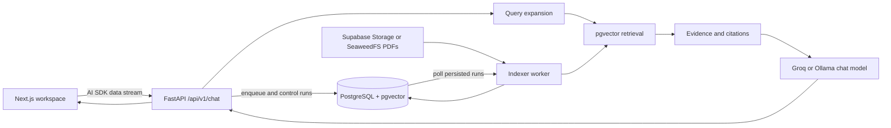
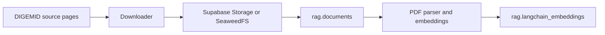

# DIGEMID RAG

DIGEMID RAG answers questions about Peruvian over-the-counter pharmaceutical documentation. It retrieves excerpts from a pgvector collection, streams a grounded answer, and attaches each claim to a PDF source and page.

The application is for document consultation. It does not replace professional medical, pharmaceutical, or regulatory advice.

## Architecture



## Repository Layout

| Path | Purpose |
| --- | --- |
| `apps/frontend` | Next.js chat workspace and citation UI. |
| `apps/backend` | FastAPI chat API, retrieval pipeline, ingestion, and indexing. |
| `docker-compose.yml` | Local PostgreSQL, SeaweedFS, Ollama, API, frontend, and indexer services. |
| `docker-compose.gpu.yml` | Optional NVIDIA GPU reservation for the Ollama service. |
| `docker-compose.amd.yml` | Optional AMD ROCm device mappings for the Ollama service. |
| `scripts/start.sh` | One-command startup that selects CPU, NVIDIA, or AMD automatically. |

## Requirements

- Python 3.14 and [uv](https://docs.astral.sh/uv/)
- Node.js and pnpm 11
- Docker Compose
- Ollama with `embeddinggemma` when using the containerized stack
- A Supabase PostgreSQL project with pgvector and a Storage bucket only for cloud mode
- A Groq API key when `CHAT_PROVIDER=groq`

## Configuration

Copy `.env.example` to `.env` at the repository root, then fill in the values:

```bash
cp .env.example .env
```

For the local Compose stack, leave `SUPABASE_DB_URL`, `SUPABASE_URL`, and `SUPABASE_SERVICE_ROLE_KEY` unset. Compose provides PostgreSQL and SeaweedFS defaults:

```env
STORAGE_BACKEND=s3
S3_ENDPOINT_URL=http://seaweedfs:8333
S3_PUBLIC_ENDPOINT_URL=http://localhost:8333
```

For cloud mode, set `STORAGE_BACKEND=supabase` and configure the Supabase variables. The storage interface keeps the ingestion, indexing, and PDF-serving code independent of that choice.

The remaining application variables are:

```env
CHAT_PROVIDER=groq
GROQ_API_KEY=<groq-api-key>
MODEL_NAME=qwen/qwen3.6-27b

EMBEDDING_MODEL=embeddinggemma
OLLAMA_BASE_URL=http://localhost:11434
VECTOR_COLLECTION=digemid
RETRIEVAL_MAX_DISTANCE=0.7
RETRIEVAL_MAX_RESULTS=12
CORS_ORIGINS=http://localhost:3000

# Optional LangSmith tracing
LANGSMITH_TRACING=false
LANGSMITH_API_KEY=<langsmith-api-key>
LANGSMITH_PROJECT=digemid-rag
LANGSMITH_ENDPOINT=https://api.smith.langchain.com
```

Create `apps/frontend/.env.local`:

```env
BACKEND_API_URL=http://127.0.0.1:8000
```

`SUPABASE_SERVICE_ROLE_KEY` belongs only in the backend environment. Do not expose it through `NEXT_PUBLIC_*` variables or client code.

Docker Compose loads the root `.env` file automatically. In Dokploy, add the same values in the Compose **Environments** panel; Dokploy does not receive local `.env` files from Git.

## Production URLs

The frontend and backend do not use `FRONTEND_URL` or `BACKEND_URL` variables.
Configure the variables that the applications actually read:

```env
# Frontend deployment environment
BACKEND_API_URL=https://api-rag.example.com

# Backend Compose environment
CORS_ORIGINS=https://rag.example.com
FORWARDED_ALLOW_IPS=172.18.0.0/16
```

`BACKEND_API_URL` is used by the Next.js server-side rewrite, so redeploy the frontend after changing it. `CORS_ORIGINS` is a comma-separated list when more than one frontend origin needs access.

For Dokploy, set `FORWARDED_ALLOW_IPS` to the exact subnet of the Traefik network, not a broad private range. Retrieve it on the VPS with:

```bash
docker network inspect dokploy-network --format '{{range .IPAM.Config}}{{.Subnet}}{{end}}'
```

## Run Locally

Start the complete local stack with the hardware-aware launcher:

```bash
./scripts/start.sh
```

The launcher reads `.env` when present and otherwise uses `.env.example`. It detects an NVIDIA GPU with `nvidia-smi`, an AMD GPU through `/dev/kfd` and `/dev/dri`, and falls back to CPU. The stack starts PostgreSQL with pgvector, SeaweedFS, Ollama, the FastAPI service, the dedicated indexing worker, and the standalone Next.js frontend. It pulls `embeddinggemma`, verifies the model manifest, and exposes the frontend at `http://localhost:3000` and the API at `http://localhost:8000`. Ollama, PostgreSQL, SeaweedFS, and the API are bound to localhost on the host. Docker services communicate through their Compose service names.

To select a backend explicitly, use `GPU_BACKEND=auto`, `cpu`, `nvidia`, or `amd`:

```bash
GPU_BACKEND=cpu ./scripts/start.sh
GPU_BACKEND=nvidia ./scripts/start.sh
GPU_BACKEND=amd ./scripts/start.sh
```

If host port `5432` is already in use, start with an alternate host port, for example `POSTGRES_PORT=55432 ./scripts/start.sh`; the backend still connects to PostgreSQL at `postgres:5432` inside Compose.

The first PostgreSQL start runs the portable schema in `docker/postgres/init/`. Initialization scripts run only when the `postgres-data` volume is created. To recreate an empty local database, use `docker compose down -v` and start again.

On a host with NVIDIA drivers and Docker GPU support, combine the GPU override with the main compose file to expose all NVIDIA GPUs to Ollama:

```bash
GPU_BACKEND=nvidia ./scripts/start.sh
```

The NVIDIA path requires the NVIDIA Container Toolkit. The AMD path uses Ollama's ROCm image and requires a Linux host with a compatible ROCm/amdgpu driver and access to `/dev/kfd` and `/dev/dri`. If the host has neither supported GPU, the default launcher uses the CPU image. To inspect the selected command without starting containers, run `./scripts/start.sh --print-command`.

For local ingestion and indexing:

```bash
docker compose run --rm app python -m app.scripts.ingest_digemid
```

The indexing screen at `http://localhost:3000/indexing` uses the background indexing API. It persists each run in `rag.index_runs`, reports document status from `rag.documents`, and can pause, resume, or cancel the active run. FastAPI only writes those commands to PostgreSQL. The always-on `indexer` Compose service polls the persisted runs and performs the bounded PDF work independently, so restarting the API does not orphan an active run. PostgreSQL leases allow the worker to reclaim documents left in `processing` after their lease expires.

To start indexing pending documents without the screen:

```bash
curl -X POST http://localhost:8000/api/v1/indexing/runs \
  -H 'Content-Type: application/json' \
  -d '{"collection":"digemid","mode":"pending"}'
```

The response contains `run_id`. Poll it until the status is `completed`, `failed`, or `cancelled`:

```bash
curl http://localhost:8000/api/v1/indexing/runs/<run_id>
```

Control an active run with `POST /api/v1/indexing/runs/<run_id>/pause`, `/resume`, or `/cancel`. The `all` mode downloads the source PDFs before indexing; `pending` only processes documents already recorded in PostgreSQL.

For frontend development with hot reload, run it outside Compose as described in `apps/frontend/README.md`; the production Compose service uses `apps/frontend/Dockerfile` and Next.js standalone output.

For a backend-only workflow:

```bash
cd apps/backend
uv sync --frozen
uv run uvicorn app.main:app --reload
```

Run Ollama separately and make `OLLAMA_BASE_URL` reachable from the API process.

## Chat Behavior

The frontend sends the most recent seven text messages: up to six prior turns plus the current user question. The backend uses prior turns only to resolve references in the current question, then retrieves evidence before answering.

Citation links open the cited PDF page. The sources panel shows the excerpt used for the answer.

## Observability and Retrieval Performance

When LangSmith tracing is enabled, each chat request is recorded as a nested trace:

```text
rag_request
├── query_expansion
├── retrieval
│   ├── query_embedding_batch
│   ├── pgvector_search   (one span per expanded query)
│   └── metadata_query
├── context_build
└── answer_generation
    └── TTFT
```

The retriever is exposed through LangChain's `BaseRetriever` interface, so callers use the standard `ainvoke(question)` API. Internally it batches all expanded-query embeddings into one Ollama embedding request, then runs the individual pgvector searches concurrently. This avoids one embedding HTTP request per expanded query while preserving visibility into each search and its latency. The retrieval flow deduplicates repeated chunks, filters by `RETRIEVAL_MAX_DISTANCE`, and returns up to `RETRIEVAL_MAX_RESULTS`; the final quantity is therefore dynamic rather than always exactly five.

Local traces improved from approximately 12.8 seconds before batching to 7.1 seconds after batching, with later warm runs around 5.1 seconds. These values vary with model warm-up, GPU availability, network latency, and the Supabase connection. The trace measures connection checkout and result handling around `metadata_query`; use `EXPLAIN (ANALYZE, BUFFERS)` separately to measure PostgreSQL statement execution.

To verify that the API is running locally:

```bash
curl -fsS http://localhost:8000/api/v1/health
```

For local Ollama GPU usage, use the hardware-aware launcher:

```bash
./scripts/start.sh
```

Verify the Ollama processor after startup:

```bash
docker compose exec ollama ollama ps
```

## Ingestion and Indexing



Run the complete ingestion flow from `apps/backend`:

```bash
uv run ingest-digemid
```

Index documents already marked as pending:

```bash
uv run python -m app.scripts.index_to_rag
```

Reset and reindex the configured collection:

```bash
uv run reindex-embeddings --yes
```

The reset command deletes collection vectors and marks documents for a clean reindex. Do not run it against a collection you need to preserve.

Cloud Supabase databases need `apps/backend/migrations/004_index_runs.sql` applied once. Fresh local PostgreSQL databases receive the same table from `docker/postgres/init/001_rag_schema.sql`.

## Verification

```bash
cd apps/backend
uv run pytest -q

cd ../frontend
pnpm lint
pnpm build
```

## Further Reading

- [Frontend guide](apps/frontend/README.md)
- [Backend guide](apps/backend/README.md)
