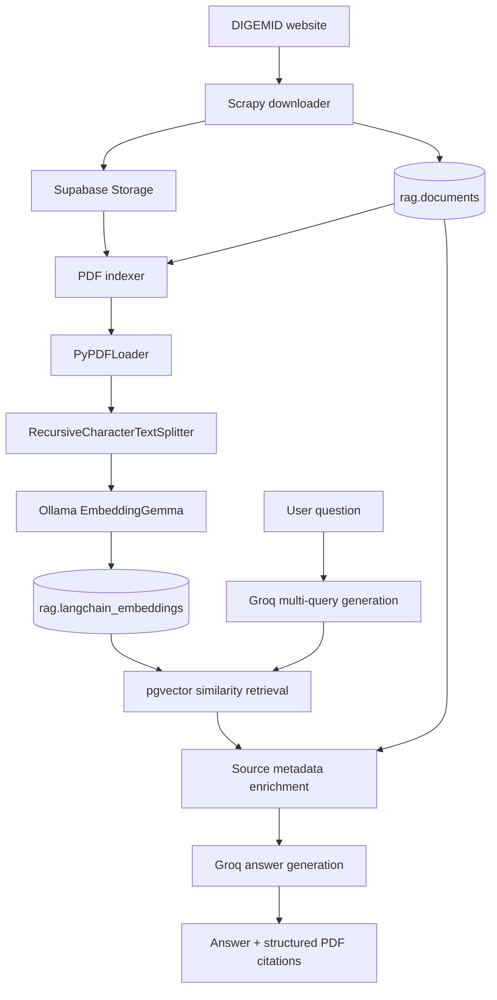
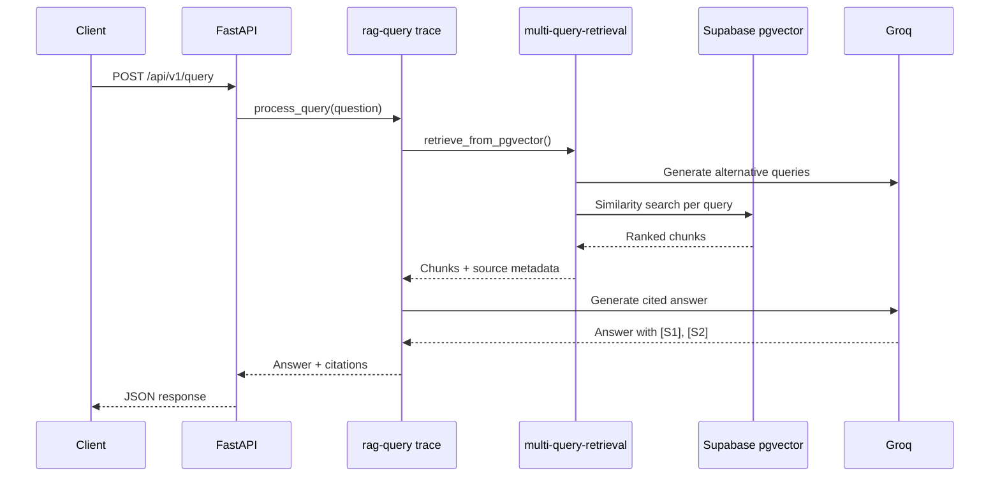

# RAG DIGEMID

RAG DIGEMID is a document retrieval service for pharmaceutical information
published by DIGEMID. It downloads official PDF documents, stores the originals
in Supabase Storage, creates local embeddings with Ollama, and retrieves cited
source chunks through a FastAPI endpoint.

## Architecture



The backend lives in `apps/backend`. Docker files and Compose configuration are
kept at the repository root.

## Main Components

- `apps/backend/app/configs/scrapy_digemid.py`: downloads PDFs and registers source documents.
- `apps/backend/app/scripts/index_to_rag.py`: claims pending documents and indexes them.
- `apps/backend/app/services/langchain_indexer.py`: parses PDFs, splits chunks, embeds them, and writes vectors.
- `apps/backend/app/services/multiquery_retriever.py`: generates alternative queries and searches pgvector.
- `apps/backend/app/services/rag_query.py`: builds the answer and citation response.
- `apps/backend/app/models/`: SQLAlchemy models for the `rag` schema.
- `apps/backend/migrations/`: database schema and RLS migrations.

## Requirements

- Docker and Docker Compose with Compose Watch support.
- Python 3.14 and `uv` for local backend development.
- A Supabase project with PostgreSQL and pgvector.
- A Groq API key for query expansion and answer generation.
- A LangSmith API key for tracing, optional but recommended during development.

Create `apps/backend/.env` locally. It is intentionally not committed:

```env
SUPABASE_URL=https://<project-ref>.supabase.co
SUPABASE_SERVICE_ROLE_KEY=<service-role-key>
SUPABASE_DB_URL=postgresql://...
GROQ_API_KEY=<groq-api-key>
OLLAMA_BASE_URL=http://localhost:11434
EMBEDDING_MODEL=embeddinggemma
MULTI_QUERY_MODEL=llama-3.3-70b-versatile
ANSWER_MODEL=llama-3.3-70b-versatile
LANGSMITH_TRACING=true
LANGSMITH_API_KEY=lsv2-<langsmith-api-key>
LANGSMITH_PROJECT=rag-digemid-dev
LANGSMITH_ENDPOINT=https://api.smith.langchain.com
```

Never commit or print credentials. Use the regional LangSmith endpoint when
required by the project deployment region.

## Database Setup

Apply the migrations in order:

```text
apps/backend/migrations/001_rag_ingestion.sql
apps/backend/migrations/002_langchain_vector_store.sql
apps/backend/migrations/003_langchain_vector_store_rls.sql
```

The important tables are:

- `rag.documents`: one row per source PDF, including filename, URL, storage key, and hash.
- `rag.langchain_embeddings`: one row per chunk, including vector, page, offsets, and parser metadata.
- `rag.embedding_config`: active embedding model and vector dimension.

## Run With Docker

Start the API and Ollama:

```bash
docker compose up --build app
```

The API is available at `http://localhost:8000`. Ollama runs at
`http://localhost:11434` and pulls the configured embedding model on startup.

Run the indexing profile after documents have been downloaded:

```bash
docker compose --profile indexing run --rm indexer
```

## Development Watch

Normal detached mode does not start the file watcher. Use one of these:

```bash
docker compose up --build --watch
```

Or run the watcher separately:

```bash
docker compose up -d --build
docker compose watch app
```

To keep it running in the background with `tmux`:

```bash
tmux new-session -d -s rag-watch 'cd /path/to/RAG && docker compose up --build --watch'
tmux attach -t rag-watch
```

Changes under `apps/backend/app` are synchronized and restart the API. Changes
to `apps/backend/pyproject.toml` rebuild the image.

## Local Backend Commands

Run these from `apps/backend`:

```bash
uv sync --frozen
uv run uvicorn app.main:app --reload
uv run python -m app.scripts.downloader
uv run python -m app.scripts.index_to_rag
uv run ingest-digemid
```

## API

Health check:

```bash
curl http://localhost:8000/api/v1/health
```

Query:

```bash
curl -X POST http://localhost:8000/api/v1/query \
  -H 'Content-Type: application/json' \
  -d '{"question":"What is ibuprofen used for?"}'
```

The response contains an answer and structured citations:

```json
{
  "answer": "Ibuprofen is used for ... [S1].",
  "citations": [
    {
      "id": "S1",
      "chunk_id": "...",
      "filename": "document.pdf",
      "url": "https://example.org/document.pdf#page=2",
      "page": 2,
      "page_label": "2",
      "total_pages": 8,
      "start_index": 1000,
      "end_index": 1860,
      "text": "Retrieved chunk text..."
    }
  ]
}
```

`page` is one-based for PDF viewers. `start_index` and `end_index` identify the
chunk within the source page text. The answer model is instructed to reference
the available sources with `[S1]`, `[S2]`, and similar markers.

## LangSmith Tracing

When tracing is enabled, each query is recorded under the configured project:



The retrieval trace includes the enriched chunk metadata. Inspect traces in
LangSmith to evaluate generated alternatives, retrieved pages, source chunks,
latency, errors, and the final answer. Do not enable full input/output tracing
for sensitive production data without reviewing the privacy requirements.

## Project Status

Implemented:

- PDF download and Supabase Storage upload.
- Pending-document indexing with Ollama embeddings.
- Multi-query pgvector retrieval.
- Groq answer generation grounded in retrieved sources.
- Structured citations with PDF URLs, pages, and chunk offsets.
- LangSmith tracing for query and indexing flows.
