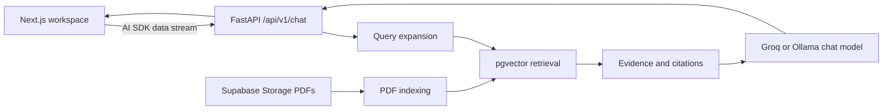
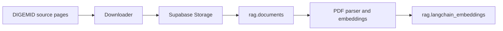

# DIGEMID RAG

DIGEMID RAG answers questions about Peruvian over-the-counter pharmaceutical documentation. It retrieves excerpts from a pgvector collection, streams a grounded answer, and attaches each claim to a PDF source and page.

The application is for document consultation. It does not replace professional medical, pharmaceutical, or regulatory advice.

## Architecture



## Repository Layout

| Path | Purpose |
| --- | --- |
| `apps/frontend` | Next.js chat workspace and citation UI. |
| `apps/backend` | FastAPI chat API, retrieval pipeline, ingestion, and indexing. |
| `docker-compose.yml` | Local Ollama, API, and indexer services. |
| `docker-compose.gpu.yml` | Optional NVIDIA GPU reservation for the Ollama service. |

## Requirements

- Python 3.14 and [uv](https://docs.astral.sh/uv/)
- Node.js and pnpm 11
- A Supabase PostgreSQL project with pgvector and a Storage bucket
- Ollama with `embeddinggemma`
- A Groq API key when `CHAT_PROVIDER=groq`

## Configuration

Copy `.env.example` to `.env` at the repository root, then fill in the values:

```bash
cp .env.example .env
```

The essential variables are:

```env
SUPABASE_DB_URL=postgresql://<user>:<password>@<host>:5432/<database>
SUPABASE_URL=https://<project>.supabase.co
SUPABASE_SERVICE_ROLE_KEY=<service-role-key>

CHAT_PROVIDER=groq
GROQ_API_KEY=<groq-api-key>
MODEL_NAME=qwen/qwen3.6-27b

EMBEDDING_MODEL=embeddinggemma
OLLAMA_BASE_URL=http://localhost:11434
VECTOR_COLLECTION=digemid
CORS_ORIGINS=http://localhost:3000

# Optional LangSmith tracing
LANGSMITH_TRACING=false
LANGSMITH_API_KEY=<langsmith-api-key>
LANGSMITH_PROJECT=digemid-rag
LANGSMITH_ENDPOINT=https://api.smith.langchain.com
```

Create `apps/frontend/.env.local`:

```env
BACKEND_API_URL=http://127.0.0.1:8000
```

`SUPABASE_SERVICE_ROLE_KEY` belongs only in the backend environment. Do not expose it through `NEXT_PUBLIC_*` variables or client code.

Docker Compose loads the root `.env` file automatically. In Dokploy, add the same values in the Compose **Environments** panel; Dokploy does not receive local `.env` files from Git.

## Production URLs

The frontend and backend do not use `FRONTEND_URL` or `BACKEND_URL` variables.
Configure the variables that the applications actually read:

```env
# Frontend deployment environment
BACKEND_API_URL=https://api-rag.example.com

# Backend Compose environment
CORS_ORIGINS=https://rag.example.com
FORWARDED_ALLOW_IPS=172.18.0.0/16
```

`BACKEND_API_URL` is used by the Next.js server-side rewrite, so redeploy the frontend after changing it. `CORS_ORIGINS` is a comma-separated list when more than one frontend origin needs access.

For Dokploy, set `FORWARDED_ALLOW_IPS` to the exact subnet of the Traefik network, not a broad private range. Retrieve it on the VPS with:

```bash
docker network inspect dokploy-network --format '{{range .IPAM.Config}}{{.Subnet}}{{end}}'
```

## Run Locally

Start Ollama and the API with Docker:

```bash
docker compose up --build app
```

The compose stack starts Ollama, pulls `embeddinggemma`, verifies the model manifest, and starts the FastAPI service on host port `8000`. Ollama remains bound to localhost. Keep port `8000` behind a firewall or private network when running on a shared host. In Dokploy, Traefik reaches the API through its internal container port.

On a host with NVIDIA drivers and Docker GPU support, combine the GPU override with the main compose file to expose all NVIDIA GPUs to Ollama:

```bash
docker compose -f docker-compose.yml -f docker-compose.gpu.yml up --build app
```

In another terminal, start the frontend:

```bash
cd apps/frontend
pnpm install --frozen-lockfile
pnpm dev
```

Open <http://localhost:3000>.

For a backend-only workflow:

```bash
cd apps/backend
uv sync --frozen
uv run uvicorn app.main:app --reload
```

Run Ollama separately and make `OLLAMA_BASE_URL` reachable from the API process.

## Chat Behavior

The frontend sends the most recent seven text messages: up to six prior turns plus the current user question. The backend uses prior turns only to resolve references in the current question, then retrieves evidence before answering.

Citation links open the cited PDF page. The sources panel shows the excerpt used for the answer.

## Ingestion and Indexing



Run the complete ingestion flow from `apps/backend`:

```bash
uv run ingest-digemid
```

Index documents already marked as pending:

```bash
uv run python -m app.scripts.index_to_rag
```

Reset and reindex the configured collection:

```bash
uv run reindex-embeddings --yes
```

The reset command deletes collection vectors and marks documents for a clean reindex. Do not run it against a collection you need to preserve.

## Verification

```bash
cd apps/backend
uv run pytest -q

cd ../frontend
pnpm lint
pnpm build
```

## Further Reading

- [Frontend guide](apps/frontend/README.md)
- [Backend guide](apps/backend/README.md)
