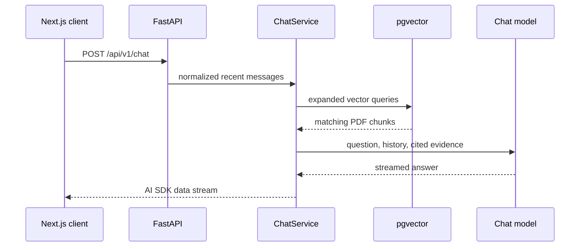

# Backend

The backend is a FastAPI service for cited RAG over DIGEMID pharmaceutical PDFs. It receives AI SDK chat messages, resolves references from recent conversation history, retrieves evidence from pgvector, and streams typed events back to the client.

Repository setup is documented in the [root README](../../README.md).

## Run

All commands run from `apps/backend`.

```bash
uv sync --frozen
uv run uvicorn app.main:app --reload
```

The API listens on `http://localhost:8000`. `SUPABASE_DB_URL` is required at startup. When `CHAT_PROVIDER=groq`, `GROQ_API_KEY` is also required.

## Observability

The chat pipeline emits nested LangSmith traces for the request, query expansion, retrieval, each query embedding, pgvector search, metadata lookup, context building, and streamed answer generation. Set these variables to enable them:

```env
LANGSMITH_TRACING=true
LANGSMITH_API_KEY=<langsmith-api-key>
LANGSMITH_PROJECT=digemid-rag
LANGSMITH_ENDPOINT=https://api.smith.langchain.com
```

The `TTFT` child span ends at the first non-empty answer chunk; `answer_generation` covers the complete answer stream. Tracing is disabled by default.

## Request Flow



## HTTP API

### `GET /api/v1/health`

Returns the service health response.

### `POST /api/v1/chat`

Accepts one current user question and up to six preceding text messages. The final message must be a non-empty user message. Assistant messages are included only as conversation context; citation metadata is stripped before the request is sent.

```json
{
  "requestId": "f7d5b1d3-9a13-4df0-9c5a-a148b7a3f85b",
  "messages": [
    {
      "id": "user-1",
      "role": "user",
      "parts": [{ "type": "text", "text": "Is ibuprofen 200 mg OTC?" }]
    },
    {
      "id": "assistant-1",
      "role": "assistant",
      "parts": [{ "type": "text", "text": "Yes, according to the cited documents." }]
    },
    {
      "id": "user-2",
      "role": "user",
      "parts": [{ "type": "text", "text": "How does it differ from diclofenac?" }]
    }
  ]
}
```

The response uses the AI SDK data-stream media type. Events include retrieval status, citation records, and answer text deltas.

## Code Map

| Path | Responsibility |
| --- | --- |
| `app/routers/chat.py` | Chat endpoint and stream response wiring. |
| `app/adapters/` | Request conversion and AI SDK stream encoding. |
| `app/services/chat.py` | Query expansion, retrieval thresholding, citations, and answer orchestration. |
| `app/services/query_generator.py` | Rewrites the current question into standalone retrieval queries. |
| `app/services/vector_retriever.py` | pgvector retrieval and source metadata enrichment. |
| `app/services/langchain_indexer.py` | PDF parsing, chunking, embeddings, and vector writes. |
| `app/scripts/` | Download, ingestion, indexing, and reindex commands. |
| `app/settings.py` | Environment-backed runtime configuration. |

## Configuration

| Variable | Required | Default | Notes |
| --- | --- | --- | --- |
| `SUPABASE_DB_URL` | Yes | None | PostgreSQL connection string. |
| `CHAT_PROVIDER` | No | `groq` | `groq` or `ollama`. |
| `GROQ_API_KEY` | For Groq | None | Required when the chat provider is Groq. |
| `MODEL_NAME` | No | `qwen/qwen3.6-27b` | Chat model identifier. |
| `EMBEDDING_MODEL` | No | `embeddinggemma` | Embedding model used for indexing and search. |
| `OLLAMA_BASE_URL` | No | `http://localhost:11434` | Ollama endpoint. |
| `VECTOR_COLLECTION` | No | `digemid` | pgvector collection name. |
| `RETRIEVAL_MAX_DISTANCE` | No | `0.7` | Maximum accepted vector distance. |
| `CORS_ORIGINS` | No | `http://localhost:3000` | Comma-separated frontend origins allowed to call the API. |
| `LANGSMITH_TRACING` | No | `false` | Enable nested LangSmith traces for the chat pipeline. |
| `LANGSMITH_API_KEY` | When tracing | None | LangSmith API key. |
| `LANGSMITH_PROJECT` | No | `digemid-rag` | LangSmith project name. |
| `LANGSMITH_ENDPOINT` | No | `https://api.smith.langchain.com` | LangSmith API endpoint. |

The vector schema requires 768-dimensional embeddings. Changing the embedding model or its dimension requires a compatible collection and a full reindex.

For a production frontend at `https://rag.example.com`, set:

```env
CORS_ORIGINS=https://rag.example.com
```

## Data Pipeline

```bash
# Download DIGEMID PDFs and index all pending documents.
uv run ingest-digemid

# Index documents already registered as pending.
uv run python -m app.scripts.index_to_rag

# Delete vectors in the configured collection and mark documents for reindexing.
uv run reindex-embeddings --yes
```

The indexer uses an advisory lock and document claims to avoid duplicate work. Its worker count is bounded by the database pool size.

## Tests

```bash
uv run pytest -q
```

Keep `uv.lock` synchronized with `pyproject.toml`. The Docker build uses `uv sync --frozen`.
