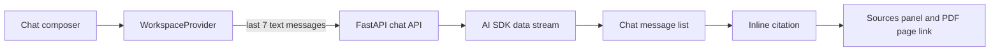

# Frontend

The frontend is a Next.js 16 chat workspace for DIGEMID RAG. It streams responses from the FastAPI backend, renders inline citations, opens a sources panel with the quoted excerpt, and links each source to its cited PDF page.

Repository setup is documented in the [root README](../../README.md).

## Run

From `apps/frontend`:

```bash
pnpm install --frozen-lockfile
pnpm dev
```

Open <http://localhost:3000>. The root route redirects to `/chat`.

The browser calls the frontend origin at `/api/v1/chat`; Next.js forwards that request to the backend from the workspace server. Set the server-side backend address in `.env.local` when the API is not running on the default local address:

```env
BACKEND_API_URL=http://127.0.0.1:8000
```

Keep `BACKEND_API_URL` server-side. Backend service keys never belong in this file.

## Deployment Environment

Set the backend address reachable from the Next.js server in the frontend deployment environment:

```env
BACKEND_API_URL=https://api-rag.example.com
```

Next.js reads this value for its server-side rewrite, so changing it requires a new build and deployment.

## Workspace Flow



`WorkspaceProvider` keeps the in-browser conversation state. A new conversation requires confirmation, then clears messages, input, retrieval status, and the open sources panel.

## Main Components

| Path | Responsibility |
| --- | --- |
| `app/(workspace)/` | Chat route and workspace layout. |
| `components/workspace/` | Conversation state, composer, message list, sources panel, and sidebar. |
| `components/ai-elements/` | Reusable streaming, message, citation, and input primitives. |
| `components/ui/` | Base UI components built on Base UI and Tailwind. |
| `lib/validation/rag-stream.ts` | Runtime schemas for streamed status and citation events. |

## Conversation Contract

The client sends the latest seven messages to `/api/v1/chat`: the current user message plus up to six preceding turns. It sends text parts only, so citation data and other UI-only parts do not enter the backend request.

When the API fails, the UI shows a generic retryable error instead of exposing raw backend validation details.

## Commands

```bash
# Development server
pnpm dev

# Production build
pnpm build

# Lint
pnpm lint

# Start a production build
pnpm start
```

## Dependencies

- Next.js 16 and React 19
- Vercel AI SDK for streaming chat state and transport
- Base UI and Tailwind CSS for interface primitives
- Streamdown for Markdown and citation rendering
